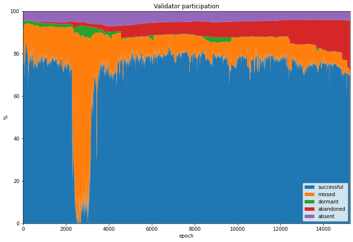
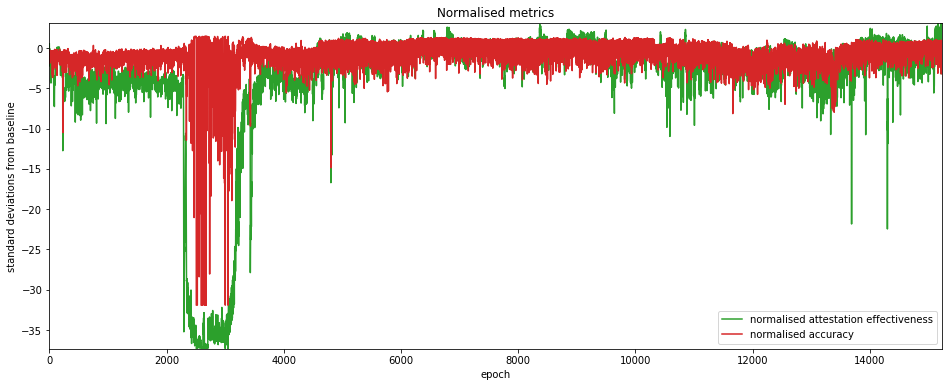
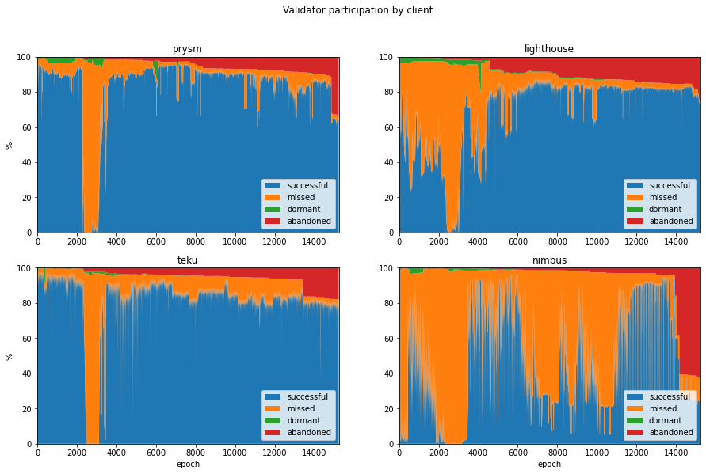

---
aliases:
  - /posts/medalla-tldr/
title: "The Medalla Data Challenge: TL;DR"
image: images/medalla-4-client-comparison_16_0.png
date: 2020-10-20 00:05
description: "Key findings from analysis of the Medalla Ethereum testnet data challenge."
---

Thank you for taking a look at my entry to the [Medalla Data Challenge](https://ethereum.org/en/eth2/get-involved/medalla-data-challenge/)! If you have time to get into some deeper analysis on Medalla testnet data, I'd encourage you to take a look at the four parts of my entry listed below, or perhaps have a look at the code in [its natural habitat](https://github.com/pintail-xyz/medalla_analysis).

- Part 1: [Data Pre-processing](/posts/2020/medalla-1-data-prep)
- Part 2: [Participation Rates: A Validator Taxonomy](/posts/2020/medalla-2-validator-taxonomy)
- Part 3: [The Medalla Network Under Stress](/posts/2020/medalla-3-network-stress)
- Part 4: [Comparing the Eth2 Clients](/posts/2020/medalla-4-client-comparison)

But if that's a bit too much, then I don't blame you. This short post will pull out some of the more interesting observations from this analysis:

# 1. An Unincentivised Testnet Has Its Limitations

It was clear from very early on was that trying to run a Proof-of-Stake network without any real *value* at stake was going to throw up some issues. In Medalla this has manifested itself in sometimes anemic participation. This has become painfully obvious in recent days as the participation rate dropped below the ⅔ level needed for finality as many validators began to throw in the towel.

But even before this point we could see the effects of validators failing to show up for duty. One contribution of the data analysis of this project is to identify which users are not treating the testnet as though validator rewards and penalties carried real value. We can even assign them names (*absent*, *dormant* and *abandoned* validators — or taken altogether: *unresponsive* validators).

As this graph shows, many validators never submitted a single attestation (purple) whilst others walked away from the network without initiating a proper *voluntary exit* (red). Still others took a long time to submit their first attestation even after they had been activated by the network (green). It's likely that this sort of behaviour would not occur in a properly incentivised testnet. But then, as has been pointed out, an incentivised testnet...[would be mainnet](https://twitter.com/benjaminion_xyz/status/1318521118752464896).

# 2. Validators Need to Prepare for Genesis

Another theme that came out from this analysis is that genesis is a time when problems are more likely to occur. It's taken several attempts before a smooth launch finally occurred (on the ephemeral Zinken testnet), and it's very possible that mainnet launch could be less than smooth. The key message is that clients need to be ready with their mainnet releases well before genesis time, and validators also need to be up and running well in advance.

The graph below shows the difference in delay distribution between genesis validators and those who joined the network later on.

# 3. The Network Tells Us When It's Struggling

The [third article](/posts/2020/medalla-3-network-stress) explores a range of metrics which may be used to highlight times that the network is experiencing stress. Two metrics in particular — *attestation effectiveness* (as defined by [Jim McDonald](https://twitter.com/jgm)) and *attestation accuracy* (with thanks to [Barnabé Monnot](https://twitter.com/barnabemonnot)) seemed to be somewhat complementary, and may be useful for identifying anomalous epochs for further analysis — they're plotted in the graph below.

# 4. The Clients Aren't All the Same

It's immediately clear when you look at the available data for different clients, that they haven't all been performing the same. Interestingly the three best-performing clients showed strengths in different areas, although one client didn't seem to reach its stride during the period examined ([read the article to find out which one!](/posts/2020/medalla-4-client-comparison)). You can draw your own conclusions from the graph below...

**Caveat:** This analysis relied on identifying clients from *block graffiti* which is manually set by users who could easily choose to mislead.

# 5. If I'm Going to Do More of this Analysis, I'll Need a Faster Computer

Hint hint.
