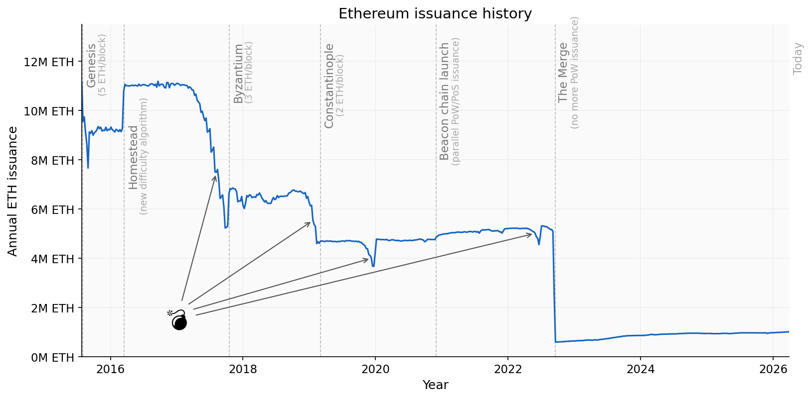

Over the last year, the environment for Ethereum staking has changed significantly. Regulatory changes in the US have emboldened providers of Exchange Traded Funds (ETFs) and Digital Asset Treasuries (DATs) to deploy their significant reserves to take advantage of the near-risk-free yield on offer from Ethereum's proof-of-stake issuance. As of April 2026, if we include Ether sitting in the staking entry queue, **the proportion of the Ether supply which is staked (the staking ratio) has surpassed 1/3 for the first time**. So now is a good time to ask: where might this lead? Is this desirable?

Questions about Ethereum proof-of-stake economics, and specifically the relationship between security and Ether issuance, are not new. As we will see, they have been debated since before the 2020 launch of the beacon chain. However, the inherently contentious proposition of altering protocol incentives has led to economic issues being sidelined in favour of uncontroversial upgrades. What I will do in this article is take a closer look at how we got here, where we appear to be headed, and the impact of this on Ethereum. Ultimately, I will make the case that we can no longer afford to push this question away. **Action to put Ethereum staking economics onto a more sustainable foundation is an urgent priority**.

# tl;dr

* Ethereum staking ratio is at all-time high and will keep rising — incentives baked into the protocol will take us close to a 100% staking ratio if we do nothing;
* This situation is the result of an issuance curve which was chosen before the emergence of liquid staking, which fundamentally altered staking economics;
* An excessive staking ratio undermines core properties of Ethereum and makes it *less* secure;
* Past the tipping point at which solo stakers are forced out, it will be very difficult, perhaps impossible to return to a desirable state;
* By adjusting the issuance curve to target a healthy staking level we restore the primacy of ETH, monetary premium, security and scarcity while creating space for a flourishing DeFi ecosystem.

# A History of Staking on Ethereum

Before making the case for issuance policy reform, I want to look at the history of staking in Ethereum for a sense of how we got here. The chart below shows the evolution of staking on Ethereum since the beacon chain launch in late 2020. The staking ratio, plotted below, refers to the proportion of the entire Ether supply which is staked in Ethereum's consensus layer. We could define this either as the *currently active* validating stake (solid line) or *all* of the Ether which is held in the consensus layer, including Ether which is in the process of joining or leaving the active set (dashed line). Due to the entry/exit queue mechanisms, the dashed line can be significantly higher than the solid line at times of high churn. 

The overall trend is obvious: consistent growth in staking ratio over time. But there are certain events, both on-chain and in the wider world, which have influenced how this growth has played out — sometimes accelerating, and sometimes plateauing. It is worth taking a look at these before we explore how the staking ratio might evolve in future. Some of the key events are marked on the chart with dashed vertical lines, with explanatory notes shown on mouseover.

::: {#fig-stakechart}



Staking ratio over time. Data aggregation using [pintail-xyz/cedar](https://github.com/pintail-xyz/cedar).

:::

## Design philosophy

But let's go back even further. If we want to know whether the staking economy is behaving as intended, we need to look at the factors which actually drove the design decisions behind it.

The plan for Proof-of-Stake Ethereum emerged gradually as researchers wrestled with problems which had invalidated the security models of earlier attempts (starting with the [nothing-at-stake problem](https://blog.ethereum.org/2014/01/15/slasher-a-punitive-proof-of-stake-algorithm)). Throughout the design phase, the emphasis was on engendering the most diverse validator set possible, and efforts to disincentivise various forms of centralisation through increased penalties for correlated failures.

[In Vitalik's 2016 design philosophy](https://vitalik.eth.limo/general/2016/12/29/pos_design.html), Ethereum's proof-of-stake mechanism was envisaged as an improvement over the earlier *delegated* proof of stake (DPoS) protocols like BitShares and Steem, and would allow a large number of individual stakers to participate directly without delegation (indeed Steem's DPoS consensus eventually proved to be its Achilles' heel, [allowing Justin Sun to wrest control of the protocol from its community by co-opting exchanges holding delegated stake](https://vitalik.eth.limo/general/2021/03/23/legitimacy.html)). Vitalik's own position on this has remained consistent; [he stated in May 2024 that](https://vitalik.eth.limo/general/2024/05/17/decentralization.html):

> To me, a robust solo staking ecosystem is by far my preferred outcome for Ethereum staking, and one of the best things about Ethereum is that we actually try to support a robust solo staking ecosystem instead of just surrendering to delegation.
>
> — Vitalik Buterin

## Staking pioneers

Despite [early optimism](https://steemit.com/ethereum/@keysikg/vitalik-buterin-confirms-ethereum-s-proof-of-stake-75-percent-complete) that a move to proof of stake would be complete by the end of 2017, as the shape of the design space became clearer, and improved technology became available (most notably [BLS signature aggregation](https://eth2book.info/latest/part2/incentives/staking/#stake-size)), the complexity of the project grew. But this was justified by the goal of maximising the number of validators the protocol could support. In order to manage this complexity, the deployment would be phased, building from a new "beacon chain" which would be launched and developed in parallel to the existing blockchain.

This culminated in the [announcement](https://blog.ethereum.org/2020/11/04/eth2-quick-update-no-19) of the beacon chain deposit contract on 4 November 2020. The launch was the result of years of research and engineering, but it delivered a chain that reached consensus only on the state of its own validator set. Ethereum's execution would continue to be secured by proof of work for an indeterminate period.

The beacon chain was, at that time, planned as "phase 0" of a rollout which would continue through "phase 1" (data sharding) and "phase 2" (execution environments). It was assumed that the existing execution chain and its state would somehow be folded into one of the new execution environments. The simpler idea of *merging* the beacon chain with the existing execution chain came later. With so much still to spec, implement and test, there was very little discussion of when depositors might again have access to the Ether locked in the contract. They had no way of withdrawing their funds and were to take it on trust that it would work out at some unspecified point in the future.

From the perspective of ETH holders at the time, all of this appeared highly uncertain. Consequently, there was [serious consideration](https://github.com/ethereum/consensus-specs/issues/2134) given to the possibility that there might not be enough interest from ETH holders to reach the minimum threshold stake of 524,288 ETH. Indeed, the concern that there might not be enough capital available to secure the chain had been long-running. Back when the beacon chain spec was still in flux in [April 2019](https://github.com/ethereum/consensus-specs/pull/971), the proposed issuance level was more than doubled, for a 5.7% staking return at a targeted level of about 10M ETH staked, up from 2.5% return in the previous version of the spec. The result was that **during the beacon chain's gestation, the principal concern was whether there would be _enough_ stake, and no consideration of whether there might be a level which was _too much_.**

::: {#fig-issuancecurve}



The issuance curve, varying with the amount of ETH staked.

:::

## Enter liquid staking

Considering the relentless focus on validator set diversity, and specifically on supporting small stakers, the envisaged staking participant was most often a solo staker — perhaps an individual enthusiast, locking up their own Ether and running their own node at home. It was accepted that institutions such as exchanges were likely to offer staking services, and an Ethereum Foundation blog post a few days after beacon chain launch [acknowledged this](https://blog.ethereum.org/2020/12/10/validated-perfect-is-the-enemy-of-the-good#-staking-services) but emphasised the increased risk of correlated failures. Solo staking was very obviously to be preferred if possible.

Outside of the Ethereum ecosystem, some groups were looking seriously at the future role of liquid staking in emerging proof-of-stake protocols, most notably Cosmos's Interchain Foundation, who funded a [report published in June 2020](https://mirror.chorus.one/liquid-staking-report.pdf) by Chorus One. With hindsight, it is rather ironic that one of the only people actively [warning about risks](https://web.archive.org/web/20201103095609id_/https://medium.com/terra-money/liquid-staking-a-discussion-of-its-risks-and-benefits-bbaa957d9233) posed by liquid staking specifically on Ethereum was Marco Di Maggio, Professor of Finance at Harvard Business School and at the time a core researcher at Terra Labs, where he worked on protocol design and stability mechanisms ([Terra collapsed catastrophically in May 2022](https://en.wikipedia.org/wiki/Terra_(blockchain)#Collapse)).

But within the Ethereum community, and amongst the protocol researchers, there seems to have been close to zero discussion about the possible impact of liquid staking. This is striking considering the rapid expansion of liquid staking in the years which followed. It is maybe less surprising when framed in the context of the design philosophy, which emphasised that delegated staking would no longer be necessary and perhaps failed to recognise the power of solutions which offered *liquidity* to eliminate the opportunity cost associated with locking up Ether in validators. Bearing in mind also that Lido was only publicly [announced in October 2020](https://web.archive.org/web/20201104202841/https://blog.lido.fi/introducing-lido/), a few short weeks before the beacon chain deposit went live, it is clear that a **consciousness of the possibilities of liquid staking emerged much too late to have any impact on the design of the protocol, despite upending assumptions about the costs of staking**.

Then, within weeks of the beacon chain launch, [Lido was accepting deposits](https://blog.lido.fi/staking-ethereum-with-lido/). And by April 2021, [prominent voices](https://www.paradigm.xyz/2021/04/on-staking-pools-and-staking-derivatives) were arguing that:

> Without staking derivatives, we might expect 15-30% of ETH to be staked. However, **with staking derivatives, this number could be as high as 80-100%**, because there is no additional cost to staking compared to non-staking.
>
> — Hasu, Georgios Konstantopoulos (emphasis mine)

## Rehypothecation

Lido's liquid staking product received a significant boost in March 2022, when Lido's proposal for integration with Aave was accepted, allowing its staked Ether token, stETH, to be used as lending collateral. This opened up the possibility of recursive/looped staking, in 5 easy steps:

1. Deposit Ether into Lido;
2. Receive yield-bearing stETH token;
3. Deposit stETH into Aave as collateral; 
4. Borrow Ether on Aave;
5. Go to step 1.

This possibility for "leveraged" staking was [promoted by Lido](https://blog.lido.fi/aave-integrates-lidos-steth-as-collateral/), with users encouraged to [repeat this process in line with their own risk appetites](https://x.com/LidoFinance/status/1498653519993311233). It was followed by the fastest growth in the staking ratio since the launch of the beacon chain, with the validator entry queue not clearing for several months. Over time, Aave allowed ever higher loan-to-value (LTV) ratios on the ETH-stETH pair, [reaching 95% in July 2024](https://aave.com/blog/lido-aave-case-study) and allowing for many-times leveraged staking, promoted by Aave as a "liquidity flywheel".

Meanwhile, many in the community became concerned that the growing role of Liquid Staking Derivatives (LSDs, later rebranded as Liquid Staking Tokens) posed a threat to Ethereum. These anxieties were expressed by Danny Ryan in his ["Risks of LSD"](https://notes.ethereum.org/@djrtwo/risks-of-lsd) article, which noted:

> although protocols such as Lido have a lot of room for improvement, this article does not target short-comings in currently implemented designs. Instead, the aim is to show that **LSD protocols have inherent issues when they exceed consensus thresholds**.
>
> ...if an LSD protocol exceeds critical consensus thresholds such as 1/3, 1/2, and 2/3, the staking derivative can achieve outsized profits compared to non-pooled capital due to coordinated MEV extraction, block-timing manipulation, and/or censorship – the cartelization of block space.
>
> — Danny Ryan (emphasis mine)

Danny argued that liquid staking protocols should self-limit to avoid breaching consensus thresholds, with many others [including Vitalik](https://x.com/VitalikButerin/status/1525301234516652032) adding their voices in support. But weeks later, the Lido DAO voted almost unanimously that it would [do no such thing](https://snapshot.org/#/s:lido-snapshot.eth/proposal/0x10abedcc563b66b1adee60825e78c387105110fa4a1e7354ab57bc9cc1e675c2) as imposing limits on its size. Nonetheless, Lido's share of staked Ether [peaked](https://dune.com/queries/1937676/3202670) just below the 33% level around the same time.

Ultimately, this period of anxiety was short-lived. Community focus was on the ongoing transition to proof-of-stake, with the Merge eventually delivered in September 2022 to a burst of euphoria and some [mainstream attention](https://www.ft.com/content/88518bc5-3af4-41c3-99b5-c0cd0ba69ab9); a welcome antidote to the series of [cascading failures](https://decrypt.co/117420/story-of-the-year-crypto-contagion-terra-ftx) which were the focus of many external observers throughout 2022.

Still, although we had started to become aware of the risks presented by a liquid staking ecosystem being flooded with excess yield, nobody seriously asked whether the financialisation of staked ETH was actually a welcome development, or brought any benefits to Ethereum's consensus mechanism. The reality was, just as Hasu and Georgios had explained, the opportunity cost of staking had been all but eliminated. All that remained was some risk premium, which dropped further the longer the beacon chain and Lido persisted. The staking yields on offer evidently exceeded this risk premium, amounting to an implicit subsidy from the protocol, and an ever-growing tax on ETH holders.

With the advent of staking withdrawals in the Shapella upgrade in April 2023, [traders worried about possible mass withdrawals impacting the Ether market](https://fortune.com/crypto/2023/04/08/ethereum-shanghai-upgrade-ether-crypto-markets/). And a modest amount of stake was withdrawn immediately after Shapella, but this was almost entirely due to the exit of Kraken's validators, as a result of Kraken's [settlement with the SEC](https://www.sec.gov/newsroom/press-releases/2023-25), which at the time viewed staking services as engaged in the sale of securities. By and large, the impact of enabling withdrawals was to derisk Ethereum staking even further, and the result was a massive inflow which quickly overwhelmed the withdrawals and led to another substantial entry queue of Ether waiting to join the active validator set. The entry queue was finally cleared more than 6 months later, but growth nonetheless continued.

## Restaking, "Native Yield"

During 2023, a couple of developments added even more incentive for ETH holders to stake. The first of these was the [Eigenlayer concept of "restaking"](https://web.archive.org/web/20230328184533/https://docs.eigenlayer.xyz/whitepaper.pdf), which generated significant interest when presented at Devcon Bogotá in October 2022. While many were attracted to the promise of increased staking yield as a reward for performing additional roles, the incentive grew significantly with the announcement of an Eigenlayer restaking "points" system. This was widely — and correctly — assumed to be a precursor to an airdrop. Considering the buzz around Eigenlayer at the time, a future airdrop appeared likely to be very lucrative, and as we have seen, the costs associated with staking were very low anyway. Meanwhile, later in 2023 the Blast L2 blockchain launched its deposit bridge, promising "native yield" for holders of ETH within the L2. Perhaps more importantly, as with Eigenlayer, depositors were given "Blast points" in expectation of a future airdrop, which occurred in June 2024.

It is difficult to separate the impact of Eigenlayer (and to a lesser extent Blast) from the general rush of inflows which followed the implementation of staking withdrawals in the Shapella hard fork. But one telling indicator is the fact that the October 2024 date when the EIGEN token was unlocked and became tradeable was very close to the peak staking ratio. With Eigenlayer's additional staking stimulus withdrawn, some of those airdrop-induced stakers exited, and the staking ratio then stagnated for a period.

## Issuance Debate

It was in the post-Shapella environment, with rapid and apparently relentless staking growth, aided by exogenous sources of yield (primarily the expected Eigenlayer and Blast airdrops) that several Ethereum researchers began to grapple seriously with the implications of high staking ratios, and the impact of liquid staking on the protocol. In particular, Caspar Schwarz-Schilling and Ansgar Dietrichs noted that the incentive for new stakers to join the staking set would not significantly diminish even approaching a 100% staking ratio, while the tax on ETH holders imposed by issuance would grow. Furthermore, there was an increasing risk of liquid staking tokens effectively supplanting ETH as the base asset of Ethereum. They argued for a policy of [stake ratio targeting](https://notes.ethereum.org/@css/targeting). But anticipating delays in agreeing and implementing a long-term solution, they also argued for an urgent [reduction in issuance](https://notes.ethereum.org/@css/electra_issuance_curve) in the Pectra hard fork, as a way of buying time and slowing staking ratio growth.

Caspar/Ansgar and other researchers were met with significant pushback from several sides. Predictably, staking services whose profits were threatened by issuance reductions opposed any change. Others argued that the changes were not needed and that issuance policy should become ossified. With several potential Ethereum Exchange Traded Funds (ETFs) under consideration by US regulators — decisions were expected in May 2024 — some may have worried that changes to Ethereum's issuance policy would spook regulators and institutions, making early 2024 exactly the wrong time to consider making any changes.

While proponents of change hoped to spark productive debate about the right level of issuance for Ethereum, the debate was stifled, and no Ethereum Improvement Proposal (EIP) managed to gain sufficient traction. Ultimately, the issuance debate was largely overtaken by wider concerns about Ethereum's strategic direction and the role of the Ethereum Foundation. Meanwhile, as we have seen, there was a pause in staking ratio growth once the Eigenlayer and Blast incentives for stakers came to an end. This may have led some to conclude that the stated problem had been overblown. However, the fundamental issues raised in the debate remained unresolved.

## On Ossification

As an aside to our history of Ethereum staking, I'd like to address one argument sometimes advanced during the 2024 issuance debate: that Ethereum's economic incentives are "good enough" as-is and should now be ossified; or perhaps that a failure to ossify immediately would be a barrier to Ether being considered "sound money". The idea that there should be a consistent issuance policy for Ether for it to gain the trust of the market seems reasonable. But I think before concluding that the current issuance policy is the right one to crystallise, it is worth considering the history of Ether issuance, presented in the chart below.

::: {#fig-issuancehistory}

The history of issuance on Ethereum. After repeated reductions in ETH issuance during the proof-of-work era, issuance is now rising due to the growing staking ratio. Data aggregation using [pintail-xyz/cedar](https://github.com/pintail-xyz/cedar).

:::

For reasons mostly to do with the proof-of-work difficulty adjustment rule, and particularly the so-called "difficulty bomb" (💣), the picture is fairly noisy. But the overall trend has been periodic reductions in issuance, up until the merge. At launch in 2015, the base issuance was 5 ETH per block. This was reduced to 3 ETH per block in the Byzantium hard fork in 2017, and then to 2 ETH per block in the Constantinople hard fork in 2019. There was a slight increase in issuance due to the beacon chain launch in 2020, but then a large cut due to proof-of-work coming to an end in the Merge in September 2022.

However, since the Merge, issuance has been growing. This is because the issuance curve increases Ether emissions with the square root of the total amount staked. Looking again at the history of issuance, we can say that an issuance change (nearly always a reduction) had been made every 2-3 years since genesis. So, in retrospect, it seems slightly odd that during the 2024 issuance debate, at a time when Ethereum issuance was continuously *rising* for the first time in its history, calls for a cut were met with protest on the basis that this harmed Ether's credibility as "sound money".

# Trajectory

We saw that during the early phase of Ethereum proof-of-stake, the possibility of Liquid Staking was not factored into protocol design. Then, the protracted period over which proof-of-stake was deployed, starting with the beacon chain launch (December 2020) and ending with the Shapella hard fork which enabled withdrawals (April 2023), gave liquid staking an enormous head start, offering depositors a way to withdraw that native stakers did not have. As noted at the start of this article, the staking ratio has now reached the 1/3 level and is still growing rapidly. So where does this leave us in April 2026? 

## The SEC, ETFs, DATs

The biggest catalyst behind current growth was the announcement in May 2025 by the Securities and Exchange Commission (SEC) that it would, within certain parameters, consider that staking services did not fall under its jurisdiction. At a stroke, this decision removed the legal barrier which had held back US financial institutions from the staking economy. As a result, the validator entry queue started growing immediately after this announcement was made in May 2025, and inflows have been sustained since then. The entry queue has not cleared for almost a year; the longest such period in Ethereum's history.

Some of this growth has been masked by a couple of other major events. The first of these was a sudden increase in ETH borrowing interest rates on Aave, reportedly triggered by [large withdrawals of ETH deposits by Justin Sun](https://x.com/robdogeth/status/1948033585404878957), and leading to a rapid unwinding of looped staking positions. The second event was a [security incident](https://www.kiln.fi/post/re-enablement-of-kiln-services-and-security-incident-information) affecting the Kiln staking service provider, leading to the immediate exit of all of its validators.

However, the most recent significant development — the decision by Digital Asset Treasuries (DATs), most notably BitMine, to stake their ETH holdings — has again led to enormous inflows. Growth past the 1/3 stake level is now effectively baked in via the entry queue. And this should come as no surprise: staking offers a yield far in excess of the opportunity cost or risk, while holding unstaked ETH is penalised through dilution.

## The Tipping Point

We should expect this trend to continue. As predicted by researchers and by empirical observation, Ethereum's staking ratio is up only. Staking incentives, as currently formulated, ensure that over time all rational actors will stake their Ether. Indeed, as Caspar and Ansgar noted, not only is there a simple economic incentive to stake to avoid dilution, but as the staking ratio grows, there is an increased risk that a Liquid Staking Token (LST) could squeeze out the roles ETH still plays as genuinely trustless collateral, meaning that users would be forced to hold LSTs instead of ETH in order to use it in DeFi. Furthermore, in a high staking ratio with a dominant staking provider, the slashing mechanism which is the basis for Ethereum's economic security could break down, as that single provider becomes in practice "too big to slash". **Above some level, increasing staking ratio actually makes Ethereum more brittle, not more secure**.

But the tipping point that I am particularly worried about is the point at which solo stakers effectively earn negative yield. This occurs because:

a. At higher staking rates, **dilution significantly affects the yield calculation**. To understand the difference between *nominal* and *dilution-adjusted* yield, imagine 100% of ETH is staked. In this environment everybody receives exactly the same issuance yield, which means in practice nobody is earning anything. All the "yield" actually does is offset dilution.
b. In most jurisdictions **solo stakers pay income tax on their nominal yield**, in the tax year in which it is earned. LST holders may be able to avoid this tax treatment, although they will still typically pay capital gains tax when they exit their staked position (disclaimer: please speak to an accountant to understand the implications in your own jurisdiction). This means that **in high-staking-ratio environments, solo staker yield can be negative in dilution-adjusted terms**, after accounting for income tax.

This issue is illustrated by the chart below. Adjust the sliders to see the impact at varying income tax rates and execution layer income.

::: {#fig-soloyield}



Solo staker yield, adjusted for dilution and income tax, ignoring fixed costs.

:::

Note that this analysis excludes solo stakers' fixed costs (hardware, electricity, internet bill), because to the group of people who have decided to stake at least 32 ETH, these costs are not really relevant. They are well within the bounds of what any homelab enthusiast might spend to run a NAS at home, for example. But what solo stakers will not be able to tolerate is an effective negative yield on their stake, once dilution and tax are taken into account.

I call this a tipping point because it is hard to see how we would get the staking ratio back down to an acceptable level once we reach the point at which solo stakers can no longer compensate for dilution.

# The Battle for Ethereum's Soul

> ...even a billion dollars of capital cannot compete with a project *having a soul*.
>
> — [Vitalik Buterin](https://vitalik.eth.limo/general/2020/12/28/endnotes.html)

So, does this really matter? I, of course, believe that it does. For me, this issue goes to the heart of what makes Ethereum unique. "Raw" or unstaked ETH is the most neutral, permissionless, censorship-resistant asset that we have, but its future role risks being undermined. Solo stakers are the fulfilment of the promise that proof-of-stake could be delivered without intermediaries, and that it remains possible to resist relentless centralisation pressure. They too will not survive unless we take action. These two things are among the clearest manifestations of Ethereum's *soul*, and they are worth protecting, even at the cost of a potentially contentious issuance change. Ethereum will be permanently harmed if we fail to respond.

But let's not end this part of the story on a negative note. Instead, consider the benefits that accrue to Ethereum (and by extension, to ETH) if we choose to act now:

1. Maximum neutrality, censorship resistance, trustlessness. Raw ETH has the lowest trust assumptions of any asset on Ethereum.
2. ETH as money. Despite the growth of stablecoins, ETH can and should play a role as money. If we protect it, raw ETH will remain a Schelling point collateral and medium-of-exchange asset within the Ethereum economy. From this, it gains a monetary premium.
3. Increased scarcity. With issuance under control, ETH is more attractive to hold and therefore more valuable.
4. Increased security. By being deliberate about the staking ratio we target, we achieve the maximum possible economic security whilst avoiding tipping into a brittle regime. With the benefits of items 1, 2 and 3 above, a more valuable ETH provides more security to the network.
5. Space for a flourishing DeFi ecosystem. Without ETH's risk-free yield crowding out other products, a more diverse and valuable economy can emerge.

# What Next?

I have argued in this article that Ethereum's issuance curve is at the root of the problems we currently face. It needs to be adjusted to express a deliberate choice about the desired staking ratio, rather than incentivising every last ETH to be staked. This is a matter of some urgency, as the staking ratio continues to climb with each passing month. Multiple possible issuance curves have been suggested in recent years, and my next article will attempt to map out the path for the right curve to adopt.

Making the right choice now may finally introduce sustainability to the Ether issuance policy, and perhaps ossification. Furthermore, a roadmap for future research set out in the [stakemap](https://stakemap.org/) points to a world in which ordinary people might again stake a portion of their holdings using spare hardware. Permissionless staking is a source of vital legitimacy for Ethereum as a neutral platform, and even if it remains a relatively small part of the overall stake, it plays a critical role in holding the bigger players to account. Without them, we face an inexorable slide towards capture by centralised entities. And then, what was it all for?
